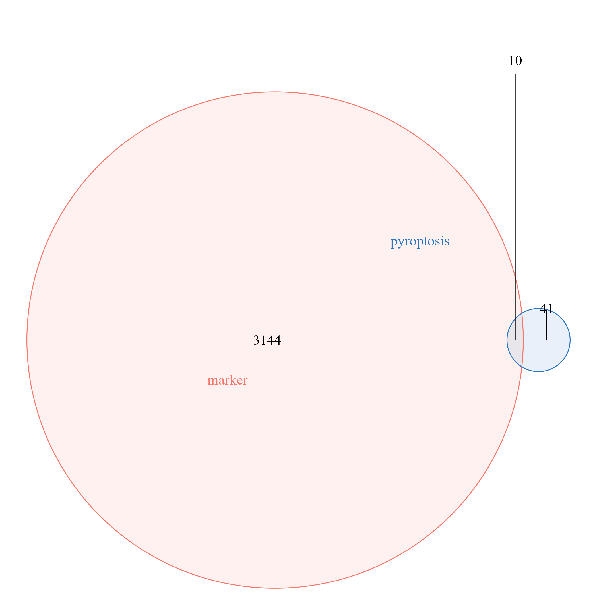

```{r setup, include=FALSE}
knitr::opts_chunk$set(echo = TRUE,warning = F,message = F)
```

#### 1.细胞数量条形图

```{r}
rm(list = ls())
library(Seurat)
load("seu.obj.Rdata")

dat = as.data.frame(table(Idents(seu.obj)))
dat$label = paste(dat$Var1,dat$Freq,sep = ":")
head(dat)
library(ggplot2)
library(paletteer)
#View(palettes_d_names)
ggplot(dat,aes(x = Freq,fill = Var1,y = Var1))+
  scale_fill_paletteer_d("ggsci::category20_d3")+
  geom_bar(stat = "identity")+
  theme_bw()+
  geom_text(aes(x = 0,label = label),hjust = 0)+
  theme(axis.text.y = element_blank(),   # 隐藏纵坐标刻度文字
        axis.ticks.y = element_blank(),
        axis.title.y = element_blank())  # 隐藏纵坐标刻度线
```

#### 2.细胞比例条形图

```{r}
seu.obj$seurat_annotation = seu.obj@active.ident
ggplot(seu.obj@meta.data,aes(orig.ident,fill = seurat_annotation))+
  geom_bar(position = "fill", alpha = 0.9,width = 0.5)+
  scale_fill_paletteer_d("ggsci::category20_d3")+
  theme_classic()+
  coord_flip()+
  coord_fixed(ratio = 4) #纵轴长度是横轴的4倍
```

#### 3.小提琴图

```{r}
load("markers.Rdata")
library(tidyverse)
g = allmarkers %>% group_by(cluster) %>% top_n(1,wt = avg_log2FC) %>% pull(gene)

m = as.matrix(seu.obj@assays$RNA@layers$data)
rownames(m) = Features(seu.obj)
colnames(m) = Cells(seu.obj)
vln.df <- m %>%
  t() %>%
  as.data.frame()%>%
  select(g) %>% 
  rownames_to_column("CB") %>% 
  mutate(cluster = seu.obj$seurat_annotation)%>%
  pivot_longer(cols = 2:(ncol(.)-1),
               names_to = "gene",
               values_to = "exp") %>% 
  mutate(gene = factor(gene,levels = g))
head(vln.df)
```

```{r fig.width= 12}
# 自定义颜色
library(paletteer)
my_color = paletteer_d(`"ggsci::category20_d3"`)
my_color = colorRampPalette(my_color)(length(unique(vln.df$cluster)))
# 画图
p1 <- ggplot(vln.df,aes(exp,cluster),color=factor(cluster))+
  geom_violin(aes(fill=cluster),scale = "width")+
  scale_fill_manual(values = my_color)+
  facet_grid(.~gene,scales = "free_y", switch = "x")+
  scale_x_continuous(expand = c(0,0),position = "top")+
  theme_bw()+
  theme(
    panel.grid = element_blank(),
    axis.title.x.top = element_blank(),
    #axis.ticks.x.bottom = element_blank(),
    axis.text.x.top= element_text(hjust = 1,vjust = NULL,color = "black",size = 7),
    #axis.title.y.left = element_blank(),
    #axis.ticks.y.left = element_blank(),
    #axis.text.y.left = element_blank(),
    legend.position = "none",
    panel.spacing.y = unit(0, "cm"),
    strip.text.y = element_text(angle=0,size = 14,hjust = 0),
    strip.background.y = element_blank()
  )
p1
```

#### 4.气泡图

```{r fig.width= 15}
g = allmarkers %>% group_by(cluster) %>% top_n(5,wt = avg_log2FC) %>% pull(gene)
DotPlot(seu.obj,features = g,cols = "RdYlBu")+RotatedAxis()
```

#### 5.GC基因韦恩图

```{r}
f = read.delim("gcgene.txt",header = F)
k = allmarkers$p_val_adj<0.05 & allmarkers$avg_log2FC>2
table(k)
g = intersect(allmarkers$gene[k],f$V1)
save(g,file = "g.Rdata")
library(tinyarray)
draw_venn(list(pyroptosis = f$V1,
               marker = allmarkers$gene[k]),"")
ggsave("venn.png")
```


```{r}
m = as.matrix(seu.obj@assays$RNA@layers$data)
rownames(m) = Features(seu.obj)
colnames(m) = Cells(seu.obj)
m = m[g,]
ac = data.frame(row.names = colnames(m),
                celltype = Idents(seu.obj))
library(dplyr)
ac = arrange(ac,celltype)
m = m[,rownames(ac)]
pheatmap::pheatmap(m,show_colnames = F,cluster_cols = F,cluster_rows = F,scale = "row",breaks = seq(-1.6,3,length.out = 100),annotation_col = ac)
```

#### 6.差异焦亡基因富集分析

```{r fig.width= 12}
e = quick_enrich(g,destdir = tempdir())
e[[4]]+e[[3]]
```

